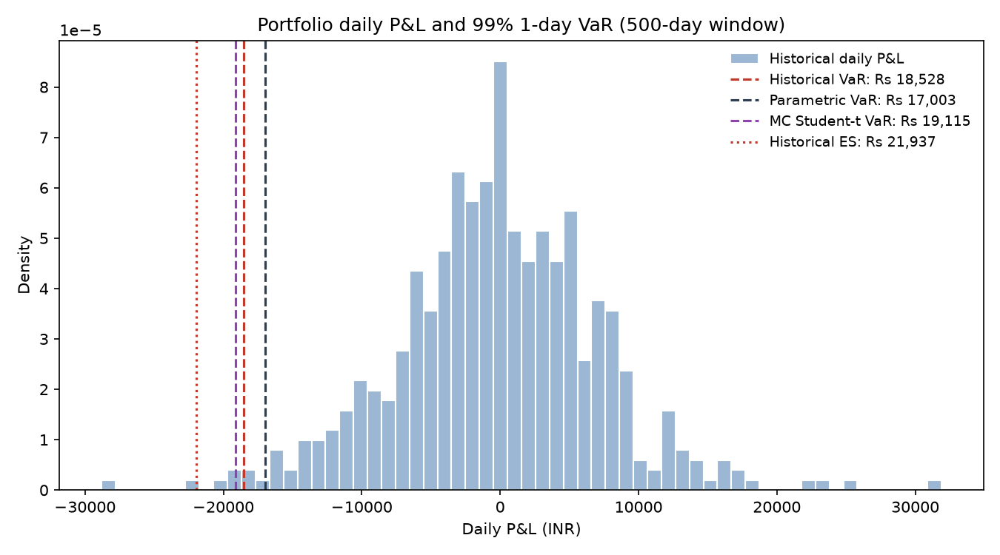
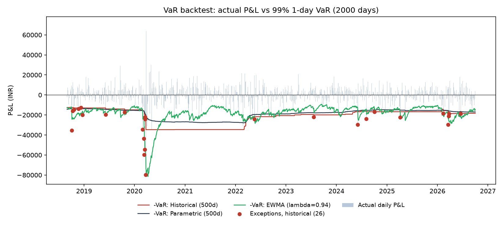
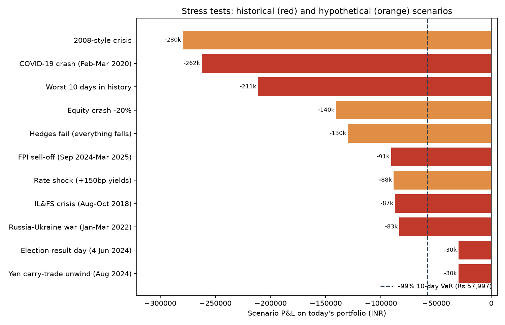
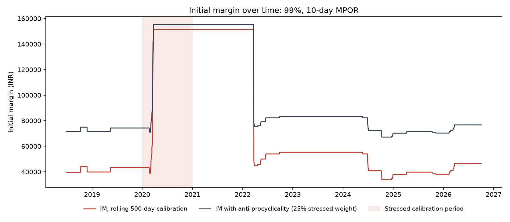

# Portfolio Risk & Initial Margin Engine

A Python risk engine for a ₹10 lakh multi-asset INR portfolio: Indian equities (Reliance, HDFC Bank, TCS, Infosys), a Nifty 50 ETF, a gold ETF, a 10-year government bond ETF and USD cash.
It measures how much the portfolio could lose (VaR, Expected Shortfall), checks whether those risk models hold up (backtesting), replays crises (stress testing), and sizes the collateral a bank should hold against the client (initial margin).

Data: daily prices from Yahoo Finance, 2016–2026.

## Key results

### 1. Value at Risk and Expected Shortfall (99%, last 500 days)
| Method | 1-day VaR | 1-day ES | 10-day VaR |
|---|---|---|---|
| Historical | ₹18,340 | ₹22,013 | ₹57,997 |
| Parametric (normal) | ₹17,000 | ₹19,477 | ₹53,760 |
| Monte Carlo (normal) | ₹17,059 | ₹19,516 | ₹53,945 |
| Monte Carlo (Student-t, 5 dof) | ₹19,154 | ₹25,461 | ₹60,571 |

- Parametric and normal Monte Carlo agree, as they should: both assume normal returns.
- Historical VaR and ES sit above the normal models, so real returns have fatter tails than a normal distribution.
- Diversification cuts risk by **38%**: standalone VaRs sum to ₹27,473 against a portfolio VaR of ₹17,000.



### 2. Backtesting
| Model | Last 250 days | Basel zone | 2018–2026 (2,000 days, 20 expected) | Kupiec | Christoffersen |
|---|---|---|---|---|---|
| Historical (500d) | 5 exceptions | Yellow | 26 | Pass | Fail (clustered) |
| Parametric (500d) | 7 exceptions | Yellow | 35 | Fail | Fail (clustered) |
| EWMA (λ = 0.94) | 4 exceptions | Green | 35 | Fail | Pass |

- Each model fails a different test. Historical VaR gets the exception count right but lags in a crisis (exceptions on 16, 17 and 18 March 2020 in a row). EWMA reacts fast enough to remove clustering but, assuming normal returns, breaches too often.
- Combining the two (filtered historical simulation) would address both weaknesses.



### 3. Stress testing (today's portfolio)
| Scenario | Loss | % of portfolio | × 10-day VaR |
|---|---|---|---|
| 2008-style crisis (hypothetical) | ₹2,79,500 | 27.9% | 4.8× |
| COVID-19 crash (19 Feb – 23 Mar 2020) | ₹2,62,426 | 26.2% | 4.5× |
| Worst 10 days in the data (6–23 Mar 2020) | ₹2,11,408 | 21.1% | 3.6× |
| Equity crash −20% (hypothetical) | ₹1,40,500 | 14.1% | 2.4× |
| FPI sell-off (Sep 2024 – Mar 2025) | ₹90,627 | 9.1% | 1.6× |
| IL&FS crisis (Aug – Oct 2018) | ₹87,265 | 8.7% | 1.5× |
| Russia–Ukraine war (Jan – Mar 2022) | ₹83,215 | 8.3% | 1.4× |

- The worst real 10-day loss was 3.6× the 99% 10-day VaR. VaR says how often a loss is exceeded, not by how much.
- In the COVID crash gold *fell* and bonds were flat: hedges offset under 1% of the loss, because correlations converge in a panic. The same gold position did hedge in 2018, 2022 and 2024–25.
- Reliance is the biggest loser in every scenario, a sign of single-name concentration (20% of the portfolio).



### 4. Initial margin (99%, 10-day margin period of risk)
| Calibration | Initial margin | % of portfolio |
|---|---|---|
| Recent (last 2 years) | ₹46,630 | 4.7% |
| Stressed (2020) | ₹1,67,091 | 16.7% |
| Anti-procyclical blend (25% stressed) | ₹76,745 | 7.7% |

- Stressed IM is **3.6×** recent IM. Rolling IM nearly quadrupled in March 2020 (procyclicality), then fell off a cliff exactly 500 days later when the COVID data left the window.
- Posted collateral is worth ₹94,300 after haircuts (0% cash, 4% government bonds, 15% Nifty ETF units), covering today's requirement.
- In a stress case where IM moves to its stressed level and the Nifty ETF collateral falls 30%, the client faces an **₹80,441 margin call**. Most of it comes from the jump in IM; the falling equity collateral adds to it, which is wrong-way risk.



### Data quality
NIFTYBEES and GOLDBEES showed prices at the wrong scale (÷10 and ÷100) on 19–20 December 2019, creating a fake 22.6% one-day portfolio loss. The data pipeline now detects price-scale jumps and corrects them. Before the fix, that one bad day had inflated parametric volatility for 500 days and made the model look better than it was.

## Methods
| Method | Idea | Strength | Weakness |
|---|---|---|---|
| Historical | Reuse the last 500 days of actual P&L | No distribution assumption; captures real fat tails | Depends on the window; only knows what has happened |
| Parametric | Assume normal returns; VaR = 2.326 × portfolio std dev | Fast; easy to break down by asset | Normality underestimates crash days |
| Monte Carlo (normal) | Simulate 100k correlated days from the covariance matrix | Flexible; extends to non-linear products | Slow; only as good as its assumed distribution |
| Monte Carlo (Student-t) | Same, with fat-tailed draws | More realistic extreme losses | Needs a choice of degrees of freedom |
| EWMA | Variance weighted towards recent days (λ = 0.94) | Reacts quickly to volatility | Still assumes normal returns |

- **Expected Shortfall:** the average loss on the worst 1% of days. FRTB uses ES instead of VaR because ES measures how bad the tail is.
- **Backtesting:** VaR is forecast using only data up to the previous day, then compared with that day's P&L. Tests used: Basel traffic light (count), Kupiec POF (rate), Christoffersen (clustering).
- **Stress testing:** historical crises replayed on today's positions, plus hypothetical shocks by asset class.
- **Initial margin:** 99% loss over a 10-day margin period of risk from actual overlapping 10-day P&L, with recent, stressed and anti-procyclical calibrations, IM by asset class, collateral haircuts and margin calls.

## Limitations
- 10-day VaR uses the √10 rule, which assumes independent days; IM uses overlapping 10-day windows, whose observations are correlated.
- The anti-procyclical blend uses the 2020 stressed period for all dates, including dates before 2020 (look-ahead in the IM-over-time chart).
- The bond ETF trades thinly (12.8% of days show no price change), which understates its risk.
- Data starts in 2016, so 2008 is a hypothetical scenario rather than a historical replay.
- Positions are held fixed in INR; no intraday moves, transaction costs or liquidity effects.

## How to run
```bash
pip install -r requirements.txt
python run_var.py                   # VaR and ES (downloads prices on first run)
python run_backtest.py              # backtest the last 250 days
python run_backtest.py --days 2000  # long backtest including the 2020 COVID crash
python run_stress.py                # stress tests on today's portfolio
python run_margin.py                # initial margin, collateral and margin call
```
Add `--synthetic` to any script to run offline on fake data, or `--refresh` to re-download prices.
Prices are cached in `data/prices.csv`; results and charts go to `outputs/`.
Change holdings and model settings in `risk_engine/config.py`, and scenarios, margin and collateral in `risk_engine/scenarios.py`.

## Project layout
```
risk_engine/config.py     portfolio and model settings
risk_engine/scenarios.py  stress scenarios, margin and collateral settings
risk_engine/data.py       download, cache, calendar alignment, price-scale fixes, returns
risk_engine/var.py        VaR and ES methods
risk_engine/backtest.py   rolling VaR, Kupiec, Christoffersen, Basel traffic light
risk_engine/stress.py     historical and hypothetical stress tests
risk_engine/margin.py     initial margin, calibration, collateral, margin calls
risk_engine/common.py     shared helpers for the run scripts
run_var.py                VaR/ES table and P&L distribution chart
run_backtest.py           backtest table, exception list and chart
run_stress.py             stress test table and chart
run_margin.py             initial margin report and IM-over-time chart
```
